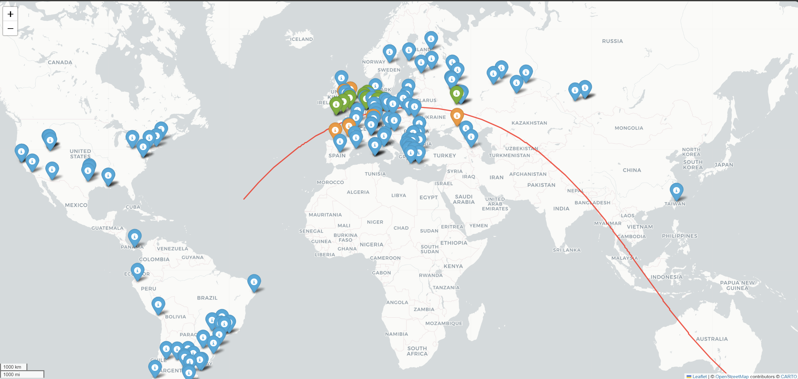

# ISS WebSDR Tracker

## Overview

**ISS WebSDR Tracker** is a Python-based tool that visualizes the real-time path of the International Space Station (ISS) and overlays the locations of online Software Defined Radios (SDRs) from the [WebSDR network](http://websdr.org/). It highlights which SDRs are within range to receive the ISS Slow Scan Television (SSTV) transmissions, particularly during special ISS SSTV events.

This project was born out of a practical need: as an amateur radio enthusiast, I found myself unable to directly receive ISS SSTV signals due to local coverage limitations. To overcome this, I leveraged the global network of WebSDRs and real-time satellite tracking data to identify which remote receivers could "see" the ISS and were tuned to the right frequency range. This allows anyone, regardless of their location, to remotely access and record ISS SSTV transmissions via the web.

## Motivation & Backstory

During ISS SSTV events, the station transmits images on 145 MHz (2m band). However, not everyone has a clear line of sight or the right equipment to receive these signals directly. The global WebSDR network provides remote access to hundreds of SDR receivers, but it's not always clear which ones are both in range of the ISS and capable of tuning to the right frequency.

This tool solves that problem by:
- Fetching the real-time ISS path using the [N2YO API](https://www.n2yo.com/).
- Fetching the list of public WebSDRs and their frequency coverage.
- Calculating which SDRs are geographically close enough to the ISS path and can tune to 145 MHz.
- Visualizing everything on an interactive map, color-coding SDRs by their proximity to the ISS path.

With this, you can quickly identify which WebSDRs to use for recording or listening to ISS SSTV transmissions, maximizing your chances of capturing the event.

## Features

- **Real-time ISS path plotting** using N2YO satellite tracking API.
- **Automatic fetching of WebSDR receiver locations and frequency bands**.
- **Distance calculation** between each SDR and the ISS path.
- **Color-coded markers**:
  - Green: SDR is within 350 km of the ISS path and covers 145 MHz.
  - Orange: SDR is within 350–500 km and covers 145 MHz.
  - Blue: SDR is out of range or does not cover 145 MHz.
- **Interactive map** with clickable SDR links and ISS path overlay.
- **Easy HTML output** for sharing or archiving.

## How It Works

1. **Fetch WebSDR Data:** Downloads the current list of public WebSDRs, including their locations and frequency bands.
2. **Fetch ISS Path:** Uses the N2YO API to get the predicted ISS positions for the next hour.
3. **Frequency & Range Filtering:** Checks which SDRs can tune to 145 MHz and calculates their minimum distance to the ISS path.
4. **Map Visualization:** Plots SDRs and the ISS path on a world map using [Folium](https://python-visualization.github.io/folium/).
5. **Output:** Saves the map as an HTML file for easy viewing.

## Usage

### Prerequisites

- Python 3.7+
- Required Python packages:
  - `requests`
  - `folium`
  - `geopy`

Install dependencies with:

```bash
pip install requests folium geopy
```

### Running the Script

1. Clone or download this repository.
2. Run the script:

```bash
python tracker.py
```

3. Open the generated `sdr_map_with_iss_path_and_distance_coding.html` in your browser.

### Customization

- **API Key:** The script uses a demo N2YO API key. For production use, [get your own API key](https://www.n2yo.com/api/).
- **Distance Thresholds:** You can adjust the distance thresholds in the script to change the color-coding.

## Example Output

Below is an example visualization generated by the ISS WebSDR Tracker.  
The map shows the ISS orbital path (red line) and nearby WebSDR receivers:  
- 🟢 In range (<350 km, covering 145 MHz)  
- 🟠 Near range (350–500 km, covering 145 MHz)  
- 🔵 Out of range or unsupported frequency  



An interactive HTML version is also available in the [`example/`](example/) folder.  
To try it yourself:  
1. Download `sdr_map_with_iss_path_and_distance_coding.html`.  
2. Open it locally in your browser.  

## Technical Details

- **ISS Path Calculation:** Uses the N2YO API to fetch the next 3600 seconds (1 hour) of ISS positions.
- **SDR Data Source:** Uses the WebSDR network's public JSON endpoint.
- **Distance Calculation:** Uses the geodesic method from `geopy` for accurate great-circle distances.
- **Map Rendering:** Uses Folium for interactive, leaflet-based maps.

## Limitations & Future Work

Currently optimized for ISS SSTV (145 MHz). Future extensions could include additional satellites, real-time updating, and direct integration with SSTV decoding pipelines.

## Acknowledgments

- [WebSDR.org](http://websdr.org/) for the global SDR network.
- [N2YO.com](https://www.n2yo.com/) for satellite tracking data.
- [Folium](https://python-visualization.github.io/folium/) and [Geopy](https://geopy.readthedocs.io/) for Python mapping and geospatial tools.

---

👤 Author: Mohamad Hassouna
